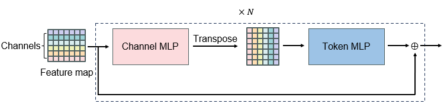
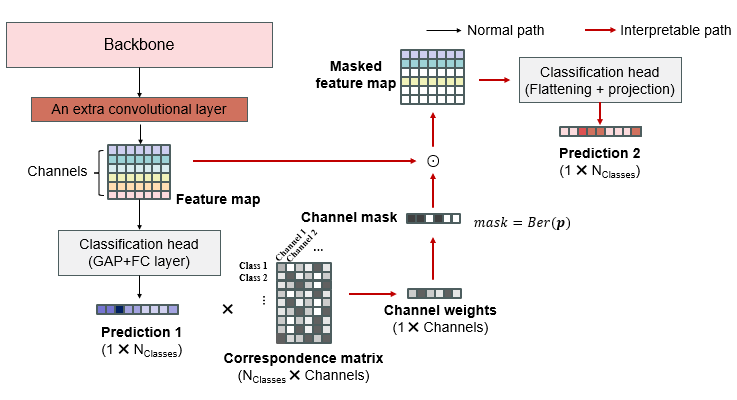
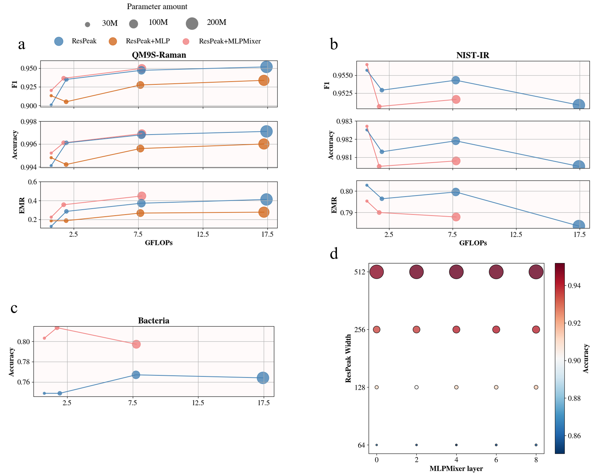
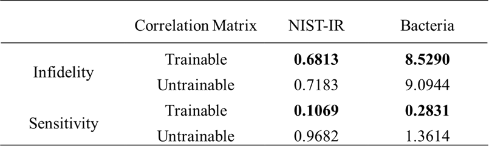
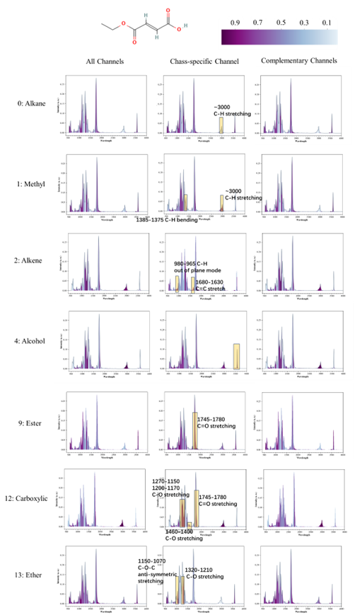
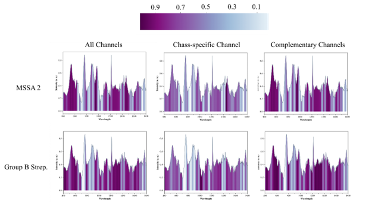

# sub_id
- High-performance and low-cost feature mixer for spectroscopy identification.
  
  
- Interpretable training path for channel-class correlation.
  
  
# Run
Adjusting block configurations, typically layer number of mlp and mlpmmixer:    
```config.py``` 

Or adjusting command in ```train.sh```, run the following in terminal:     
```./train.sh```    

> e.g.
`/home/ytliu/.conda/envs/multispec/bin/python main.py --train --net MLPMixer --depth 6 --use_mixer 1 --use_res 1 --use_se 1 --n_fc 0 --n_mixer 20 --device cuda:0
`
# Result

1. MLPMixer Evaluation

      > Figure 1 Performance of models with ResPeak (an inception + SE attention feature extractor) combining: no feature mixer (ResPeak), MLP (ResPeak + MLP) and MLPMixer (ResPeak+MLPMixer). by varying model size on datasets: (a) QM9S-Raman, (b) NIST-IR and (c) bacteria, as well as (d) the effect of adding ResPeak's width (channel number) and MLPMixer layer.

2. IP Evaluation
   > Table 1 Infidelity and sensitivity of ResPeak + MLPMixer model with trainable/untrainable (correlation matrix is randomly initialized as constant).
   

   
  
   > Figure 2 Grad-CAM of ResPeak + MLPMixer model using: all channels (first column), class-specific channels (second column) and complementary channels (thrid column) to a molecule in NIST-IR dataset.

  
   > Figure 3 Grad-CAM of ResPeak + MLPMixer model using: all channels (first column), class-specific channels (second column) and complementary channels (thrid column) to a molecule in bacteria dataset.
