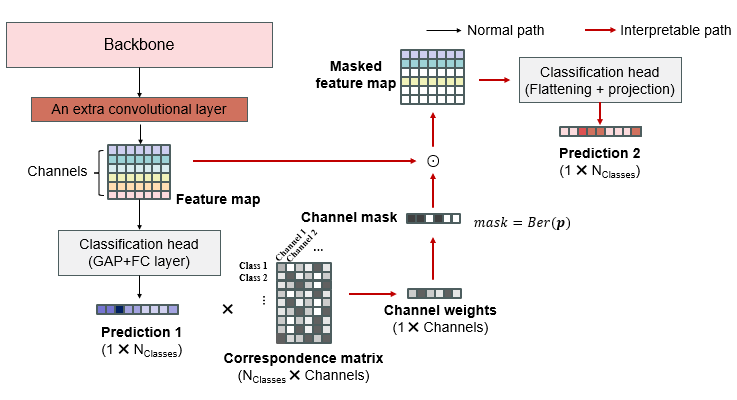

# sub_id
- High-performance and low-cost feature mixer for spectroscopy identification.
  
  
- Interpretable training path for channel-class correlation.
  
  
# Run
Adjusting block configurations, typically layer number of mlp and mlpmmixer:    
```config.py``` 

Or adjusting command in ```train.sh```, run the following in terminal:     
```./train.sh```    

> e.g.
`/home/ytliu/.conda/envs/multispec/bin/python main.py --train --net MLPMixer --depth 6 --use_mixer 1 --use_res 1 --use_se 1 --n_fc 0 --n_mixer 20 --device cuda:0
`
