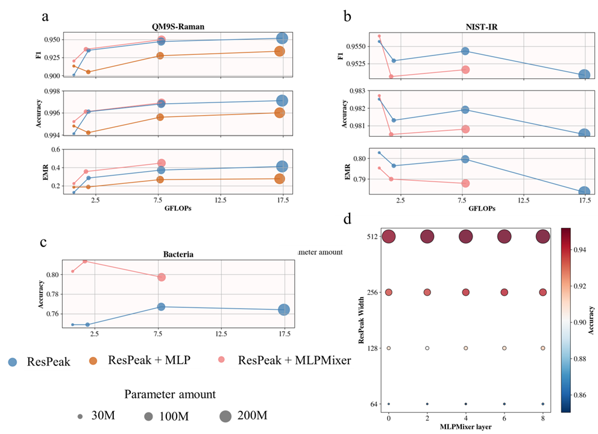

# 2D Feature Mixer and Interpretable Training Path for Characterization Using Vibrational Spectroscopy
## Background
Spectroscopy, especially vibrational spectroscopy i.e. IR and Raman, provide fingerprint of molecules and play a key role in material identification and biochemical detection. Deep learning-assisted characterization through spectroscopy has largely accelerated the progress of chemistry discovery and biomolecule's detection methods. Despite various deep learning models with advanced feature extractors (e.g. CNN, RNN and Transformer), efforts have seldom been made on developing effective feature mixer. Current ones including MLP and Transformer, fall short in handling large amount of data due to their heavy architectures, and hence cause high computational cost. This repo is for the proposal of a 2D and MLP-based feature mixer, named MLPMixer. By evaluation on both two main identification tasks, i.e. molecular substructure identification and bacteria classification, it shows a better performance with lower cost compared to traditional feature mixers. Also, a path through which models learn their channel-class correlation is proposed to imporve their interpretability. By calculating Grad-CAM using class-specific channels, such method captures a clearer explanation of model's decision rules, which fits the real spectroscopic knowledge. Its robustness has also been proved by a lower infidelity and sensitivity.

## Dataset
1. Substructure identification
    - Theoretical Raman dataset: [QM9S-Raman](https://figshare.com/articles/dataset/QM9S_dataset/24235333) ~130k spectrum, 957 ssubstructures.
    - Experimental IR dataset: [NIST-IR](https://webbook.nist.gov/chemistry/) ~8k spectrum, 17 substructures.
    
2. Bacteria in [J. Donnie et al. Nat. Commun. 10, 4927 (2019](https://www.nature.com/articles/s41467-019-12898-9#additional-information) with 30,000 Raman spectrum for pre-training and 3,000 for finetuning.

## Methods
1. PeakMxer
PeakMixer combines the Peak module and MLPMixer as a whole.
    - MLPMixer
      
      
    - Peak modules for feature extraction: ResPeak for substructures (a), CNN-Peak (b) for bacteria.
      
      

2. Interpretable path (IP) for channel-class correlation. Backbone refers to feature extractor + mixer.
  
  
## Run
```./train.sh```    
### Command:
`/home/ytliu/.conda/envs/multispec/bin/python main.py --train --net MLPMixer --depth 6 --use_mixer 1 --use_res 1 --use_se 1 --n_fc 0 --n_mixer 20 --device cuda:0
`
## Result
### MLPMixer Evaluation


   > Figure 1 Performance of models with ResPeak (an inception + SE attention feature extractor) combining: no feature mixer (ResPeak), MLP (ResPeak + MLP) and MLPMixer (ResPeak+MLPMixer). by varying model size on datasets: (a) QM9S-Raman, (b) NIST-IR and (c) bacteria, as well as (d) the effect of adding ResPeak's width (channel number) and MLPMixer layer.

### IP Evaluation
   > Table 1 Infidelity and sensitivity of ResPeak + MLPMixer model with trainable/untrainable (correlation matrix is randomly initialized as constant).
   

   
  
   > Figure 2 Grad-CAM of ResPeak + MLPMixer model using: all channels (first column), class-specific channels (second column) and complementary channels (thrid column) to a molecule in NIST-IR dataset.

  
   > Figure 3 Grad-CAM of ResPeak + MLPMixer model using: all channels (first column), class-specific channels (second column) and complementary channels (thrid column) to a molecule in bacteria dataset.
